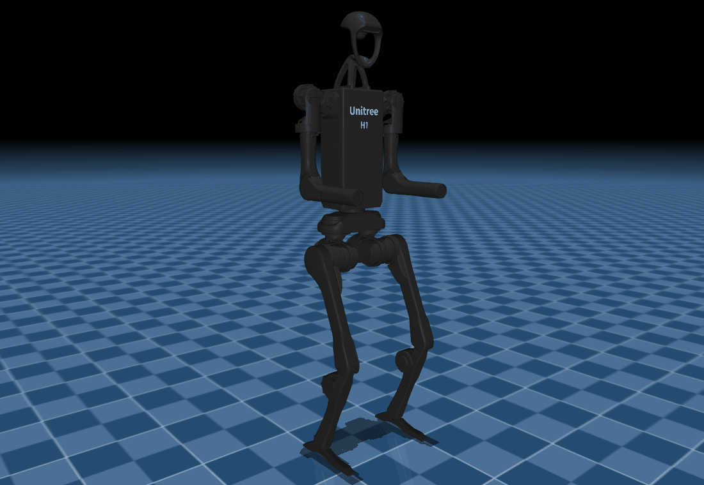

# ROS-Humanoids

A ROS 2 workspace for humanoid robot descriptions and bringup. Robots are
declared in a single registry, and one launch entry point resolves that registry
and dispatches to the bringup files of the robot that was asked for. The
workspace currently holds the Unitree G1 and the Unitree H1, together with a C++
library that turns the G1 description into joint limits, forward kinematics and
a centre of mass.

| Unitree G1 | Unitree H1 |
| --- | --- |
|  |  |

## Requirements

ROS 2 Humble with `gazebo_ros`, `robot_state_publisher`, `joint_state_publisher_gui`
and `rviz2`. The model library additionally needs `urdfdom` and `orocos_kdl`.
MuJoCo and Pillow are optional and used only by the renderers in `tools/`.

## Quick start

```bash
colcon build
source install/setup.bash

ros2 launch launch/spawn_robot.launch.py robot:=g1
ros2 launch launch/spawn_robot.launch.py robot:=g1 model:=29dof
ros2 launch launch/spawn_robot.launch.py robot:=g1 sim:=gazebo z:=1.0
ros2 launch launch/spawn_robot.launch.py robot:=h1 sim:=gazebo
```

`robot:`, `sim:` and `model:` are validated against `config/robots.yaml`, and an
unrecognised value reports the alternatives that the registry offers.

## Repository layout

| Path | Contents |
| --- | --- |
| `config/robots.yaml` | the robot registry: variants, descriptions and bringup directories |
| `launch/spawn_robot.launch.py` | the entry point that resolves the registry and includes a robot's bringup |
| `launch/bringup_common.py` | description lookup shared by the bringup files |
| `robots/<robot>/description/` | URDF, MJCF, meshes and viewer configuration |
| `robots/<robot>/bringup/` | the RViz and Gazebo launch files for that robot |
| `robots/g1/g1_model/` | the C++ model library for the G1 |
| `tools/` | offscreen MuJoCo renderer used for the screenshots |
| `docs/` | generated images |

## Supported robots

| Robot | Variants | Actuated joints | Mass | Backends | Real hardware |
| --- | --- | --- | --- | --- | --- |
| Unitree G1 | `23dof`, `29dof` | 23, 29 | 34.1 kg, 35.1 kg | RViz, Gazebo Classic | not wired up |
| Unitree H1 | `19dof` | 19 | 59.3 kg | RViz, Gazebo Classic | not wired up |

The G1 `23dof` build has a fixed waist and roll-only wrists; the `29dof` build
adds waist roll and pitch and two further joints per wrist. The H1 carries five
joints per leg, four per arm and a torso yaw joint.

## Model library

[`robots/g1/g1_model/`](robots/g1/g1_model/) reads the shipped URDFs and exposes
a canonical joint order, joint limits with clamping, forward kinematics for any
link, and the whole-body centre of mass. It has no runtime ROS dependency, so
offline tooling and tests can link against it directly. Its test suite runs
against the description files themselves and fails if their shape changes.


The animation is drawn frame by frame from the model's link poses, with the
centre of mass and its ground projection marked in red.

## Adding a robot

1. Place the description package under `robots/<name>/description/`.
2. Add `robots/<name>/bringup/<name>_rviz.launch.py`, and any further backend,
   each accepting a `model` argument.
3. Register the robot in `config/robots.yaml` with its variants and their URDFs.

## Current limitations

- No controllers. The Gazebo bringup spawns a robot and publishes its state,
  with no `ros2_control` stack behind it.
- The model library covers the G1 only.
- The G1 MJCF files cannot be opened by the MuJoCo viewer as shipped: their
  `meshdir` does not resolve to `../meshes`, and `scene_*.xml` redefines assets
  that the robot file already declares. The renderer in `tools/` works around
  both while loading. The G1 description is upstream material and is left
  unmodified.

## Licensing

The robot descriptions come from
[unitreerobotics/unitree_ros](https://github.com/unitreerobotics/unitree_ros)
under the BSD 3-Clause licence. See `robots/h1/description/README.md` for the
changes made to the H1 package while vendoring it.
