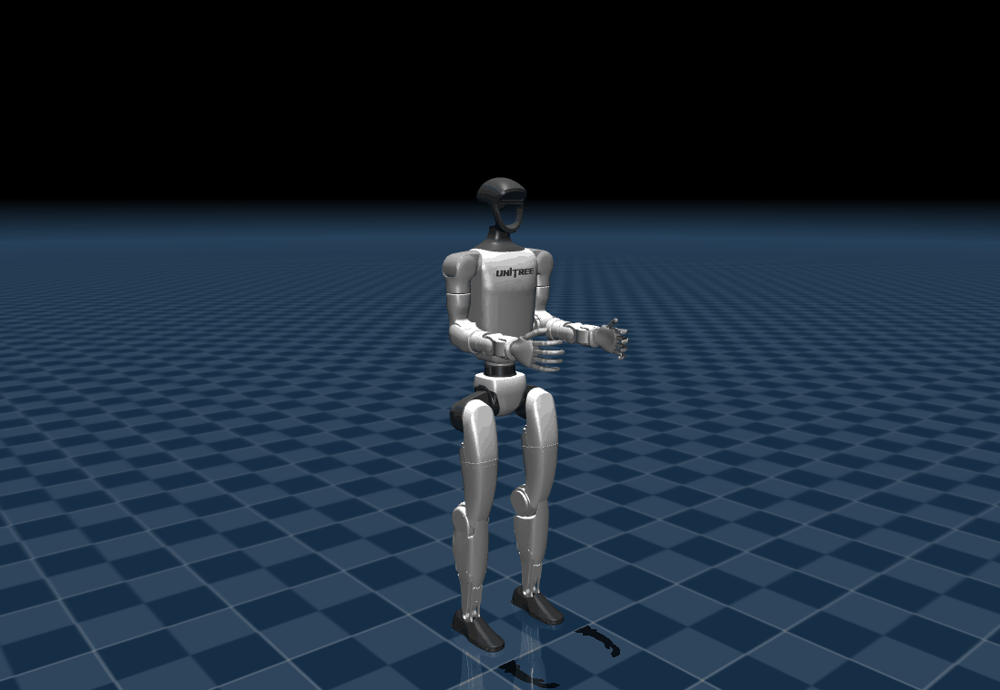
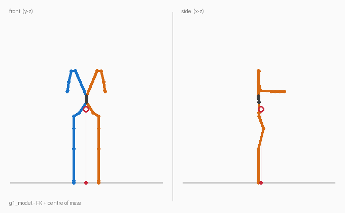

# g1_model

C++ model of the Unitree G1, built directly from the URDFs in
[`g1_description`](../description). No ROS node, no middleware: a plain library
that controllers, state publishers and tests can share.

*The 29-DOF G1 at its nominal pose, rendered offscreen in MuJoCo from
`mjcf/g1_29dof.xml`.*

It covers both variants (`g1_23dof.urdf`, `g1_29dof.urdf`) and provides:

- a **canonical joint order** taken from the kinematic tree (left leg, right
  leg, waist, arms) so that joint vectors mean the same thing everywhere;
- **joint limits** (position, velocity, effort), with violation reporting and
  clamping;
- **forward kinematics** for any link, absolute or relative to another link;
- **mass and whole-body centre of mass** in the pelvis frame.

*Every line above is drawn from the model's own link poses. The red circle is
the centre of mass and the red dot on the ground is its projection. Nothing is
hard-coded: the figure is exactly what the shipped URDF says, so it changes with
the description.*

## Layout

| Path | What it holds |
| --- | --- |
| `include/g1_model/` | the public header |
| `src/` | the implementation |
| `test/` | 25 gtest cases run against the real URDFs |
| `examples/` | small command line tools that print or dump what the model knows |
| `tools/` | the renderers that produce the pictures above |
| `docs/` | the pictures themselves |
