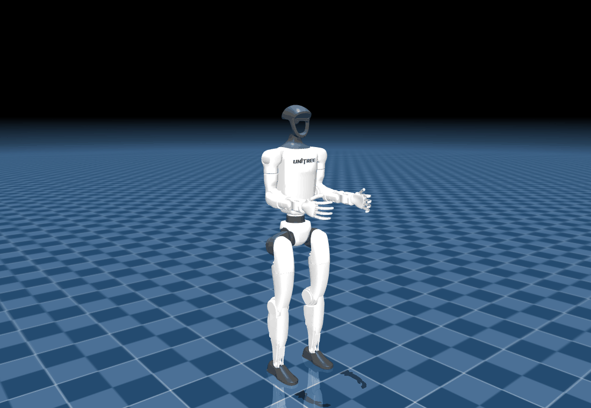

# g1_model

C++ model of the Unitree G1, built from the URDFs in
[`g1_description`](../description). It has no runtime ROS dependency, so
controllers, state publishers, offline tooling and tests can all link against
it.

The 29-DOF G1 at its nominal pose, rendered offscreen in MuJoCo from
`mjcf/g1_29dof.xml`.

It covers both variants, `g1_23dof.urdf` and `g1_29dof.urdf`, and provides:

- a canonical joint order taken from the kinematic tree: left leg, right leg,
  waist, then arms;
- joint limits for position, velocity and effort, with violation reporting and
  clamping;
- forward kinematics for any link, absolute or relative to another link;
- mass and whole-body centre of mass in the pelvis frame;
- the joint torques that hold the robot against gravity, used as the
  feedforward term in [`g1_control`](../g1_control).

Every line above is drawn from the model's own link poses. The red circle marks
the centre of mass and the red dot on the ground marks its projection.

## Layout

| Path | Contents |
| --- | --- |
| `include/g1_model/` | the public header |
| `src/` | the implementation |
| `test/` | 29 gtest cases, run against the description URDFs |
| `examples/` | command line tools that report or dump the model state |
| `tools/` | the renderer that produces the animation above |
| `docs/` | generated images |
